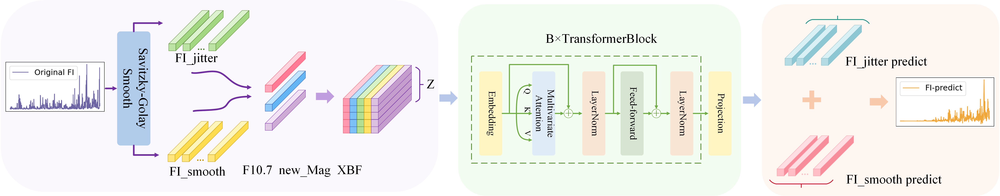

# Dual-Stage Flare Prediction Using Full-Disk Flare Index: Trend-Disturbance Decomposition and Hybrid Forecasting Model

This repository contains code and data for the paper “Dual-Stage Flare Prediction Using Full-Disk Flare Index: Trend-Disturbance Decomposition and Hybrid Forecasting Model.” The project focuses on reliable full-disk solar flare prediction by decomposing the Flare Index (FI) and employing a regression–classification framework for maximum flare intensity prediction.

## Overview
We introduce a two-stage framework built on the full-disk FI:
1. **Decomposition & Forecasting.** FI is split into a long-term **trend** and a short-term **disturbance** via a trend–disturbance strategy. Each component is forecast **independently** using **iTransformer**, then fused to produce high-fidelity FI predictions.  
2. **Regression–Classification Mapping.** Predicted FI values are mapped to flare intensity classes (e.g., M-class, X-class) using a regression–classification architecture, enabling maximum-intensity forecasts.

## Project Structure

### 1. Dataset
The `Dataset` folder includes the essential data used in this project:

- **Origin_new_multi_data_FI.csv**: This file contains the original full-disk Flare Index (FI) time series data along with other relevant features, without any trend–disturbance decomposition or filtering applied.  
- **Origin_new_multi_data_FImax.csv**: This file contains the original maximum flare intensity index (FIₘₐₓ) time series data along with other relevant features, without any trend–disturbance decomposition or filtering applied.  
- **SG_new_multi_data_FI.csv**: This file provides the Flare Index (FI) time series after trend–disturbance decomposition using Savitzky–Golay (SG) filtering, including both the smoothed (trend) sequence and the disturbance sequence, along with additional features.  
- **SG_new_multi_data_FImax.csv**: This file provides the maximum flare intensity index (FIₘₐₓ) time series after trend–disturbance decomposition using Savitzky–Golay (SG) filtering, including both the smoothed (trend) sequence and the disturbance sequence, along with additional features.

### 2. FI_jitter and FI_smooth
These two folders contain the primary experimental content and scripts:

- **FI_jitter**: Contains scripts focused on analyzing and modeling the jitter sequence extracted from the FI data.
- **FI_smooth**: Contains scripts dedicated to analyzing and modeling the smoothed FI sequence.

#### Models, Utils, Layers, Data Provider
These folders contain the core components for building and training the models:

- **models**: Contains the model architectures used for Flare Index (FI) prediction.  
- **utils**: Utility functions used throughout the project for data processing, analysis, and evaluation.  
- **layers**: Custom layers and modules designed to enhance the models' predictive capabilities.  
- **data_provider**: Functions and scripts for loading, preprocessing, and constructing datasets for model training and evaluation.

#### Main Program and Configuration

- **exp folder**: Houses the main scripts that drive the experiments, coordinating the data flow and model interactions.
- **run_pred3.py**: The central script for configuring, training, and testing the models. This script allows for flexible experimentation by adjusting parameters and settings directly within the configuration.
- 
#### Schematic of the proposed FI prediction strategy
The model structure of the new prediction strategy proposed in this paper is as follows:

## Getting Started

### Prerequisites
To run this project, you'll need the following dependencies:

- Python 3.8
- Required Python libraries (listed in `requirements.txt`)

  
## Acknowledgements
We sincerely thank the anonymous reviewers for their valuable comments and constructive suggestions, which have significantly improved the quality and clarity of this paper. We gratefully acknowledge the Dominion Radio Astrophysical Observatory (Penticton, Canada), the National Oceanic and Atmospheric Administration (NOAA), and the Space Weather Prediction Center (SWPC) for providing the F10.7 indices and their contributions to the dataset. We also thank both SWPC and the Space Environment Prediction Center (SEPC) of the National Space Science Center(NSSC), Chinese Academy of Sciences, for supplying forecast data. This research was supported by the Strategic Priority Research Program of the Chinese Academy of Sciences(No. XDB0560000).
